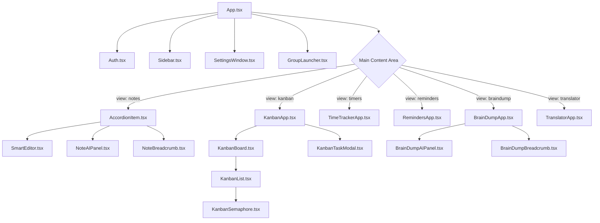

# Arquitectura de Keep Note Groups

Este documento describe la estructura de componentes, los tipos de datos y la integración con Supabase del proyecto.

## 1. Árbol de Componentes (Desde App.tsx)

La aplicación utiliza un sistema de vistas globales (`globalView`) para alternar entre los diferentes módulos.

## 2. Entidades e Interfaces (`types.ts`)

Las interfaces principales definen el modelo de datos utilizado en toda la aplicación:

| Interface | Descripción |
| :--- | :--- |
| `Note` | Entidad central. Contiene `title`, `content` y metadatos de IA/UI. |
| `Group` | Contenedor de notas (`Note[]`). Relacionado con `Note` vía `group_id`. |
| `Task` | Tarea del tablero Kanban. Se vincula a notas por `id` (`source_id`). |
| `Reminder` | Recordatorios con fecha de vencimiento (`due_at`) y estado. |
| `Timer` | Seguimiento de tiempo (cronómetros y cuentas regresivas). |
| `BrainDump` | Notas rápidas/borradores con jerarquía opcional. |
| `Translation` | Registro de textos traducidos. |

## 3. Cliente de Base de Datos (`src/lib/supabaseClient.ts`)

- **Tecnología**: [Supabase](https://supabase.com/) (PostgreSQL + Realtime Sync).
- **Configuración**: Utiliza variables de entorno `VITE_SUPABASE_URL` y `VITE_SUPABASE_ANON_KEY`.
- **Sincronización**: `App.tsx` implementa escuchadores de `postgres_changes` para mantener el estado local actualizado en tiempo real para todas las tablas (`notes`, `groups`, `tasks`, `reminders`, etc.).

## 4. Relaciones entre Módulos

### Notas & Grupos
- Relación **uno-a-muchos**. Cada `Note` pertenece a un `Group`.
- El `Sidebar` permite filtrar y navegar por grupos.

### Kanban & Notas
- Las notas pueden actuar como tareas en el Kanban.
- Al actualizar el título de una nota en la vista principal, `App.tsx` sincroniza automáticamente el título en la tabla `tasks` si existe un ID coincidente.
- `KanbanApp` permite abrir una nota directamente desde una tarjeta del tablero.

### Recordatorios & UI
- Existe una integración visual global: si hay recordatorios vencidos, aparece un banner (marquee) en la parte superior de la aplicación.
- El `Sidebar` también muestra indicadores visuales de recordatorios pendientes/vencidos en los grupos correspondientes.

### BrainDump & Kanban
- Los `BrainDumps` son independientes de las notas estructuradas pero pueden vincularse al Kanban.
- **Reglas de UI Inamovibles**:
    - El **encabezado** del pizarrón debe permanecer limpio: **PROHIBIDO** añadir botones de "Vincular a Kanban" o iconos de estado (Semáforos) en el header principal.
    - La gestión de vinculación se realiza **EXCLUSIVAMENTE** a través del menú de opciones (tres puntos).
    - La opción "Añadir a Kanban" en el menú solo es visible si el pizarrón no está ya en el Kanban.
    - La sincronización de títulos entre Pizarrón y Tarea de Kanban es automática mediante triggers de base de datos.
    - No añadir opciones de "Cerrar Vista" en los menús internos si ya existe una navegación global clara.
